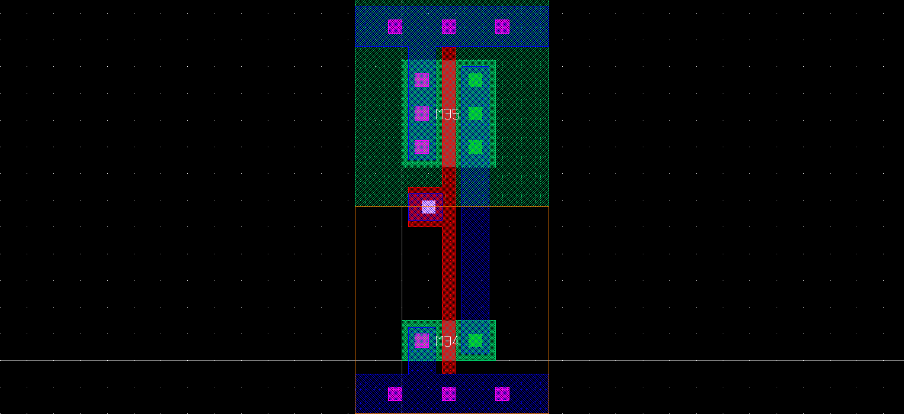
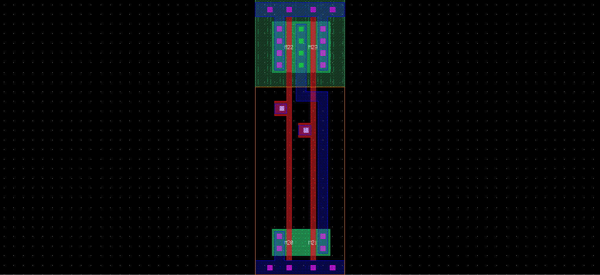
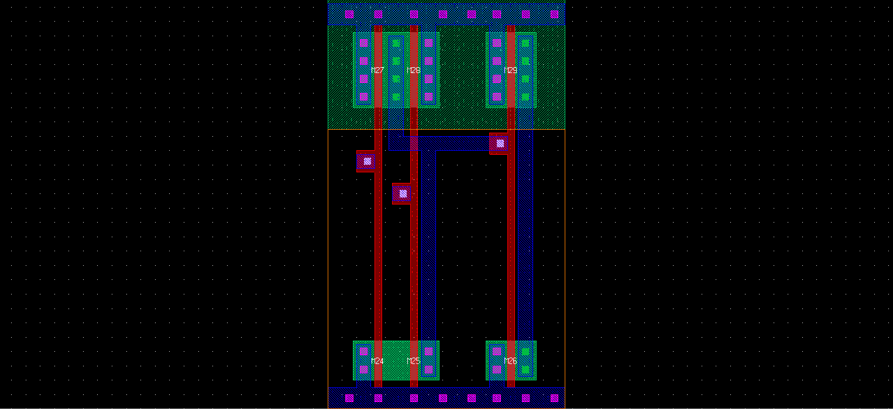
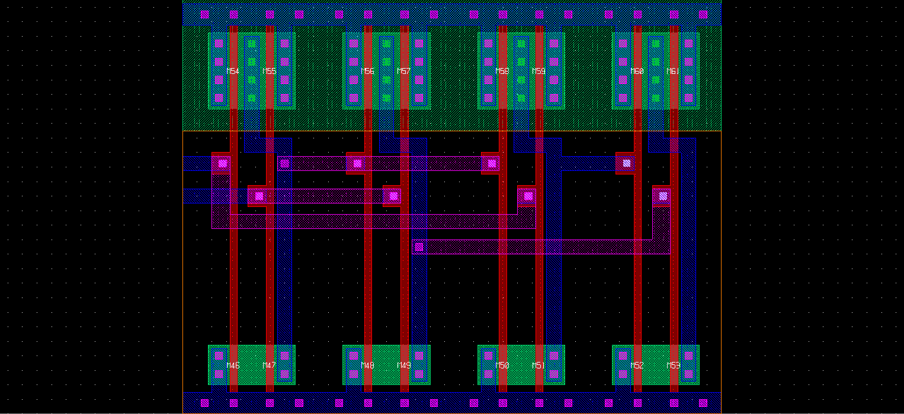
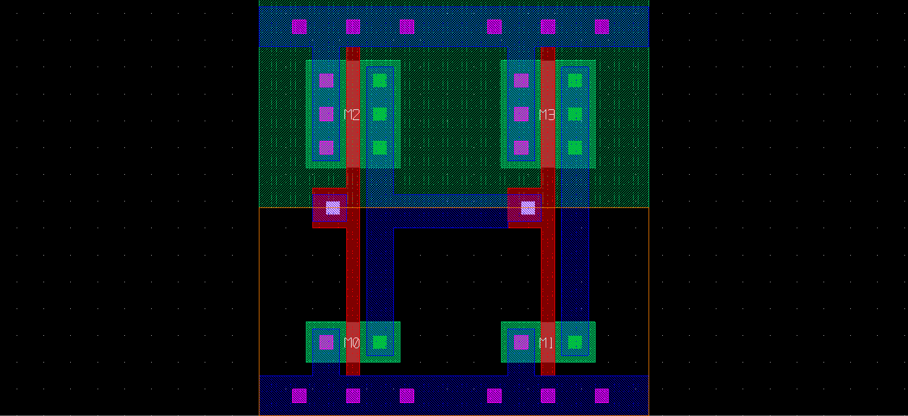

# MicroelectronicsResearch

#### Resources to Study
* http://madvlsi.olin.edu/madvlsi/handouts.html
* https://www.u-cursos.cl/usuario/9553d43f5ccbf1cca06cc02562b4005e/mi_blog/r/CMOS_Circuit_Design__Layout__and_Simulation__3rd_Edition.pdf
* http://www.cmosedu.com/jbaker/courses/ee421_ecg621/f20/lec_ee421_ecg621.htm
* https://www.youtube.com/user/bminch
* http://www.opencircuitdesign.com/magic/
* http://swarm.cs.pub.ro/~mbarbulescu/SMPA/CMOS-VLSI-design.pdf

#### Goals
* Digital layout design for basic electrical components
##### Gates
* INV

* NAND2

* AND2

* NOR2

* OR2

* XOR2

##### Buffer

##### Adders

* Bitwise adder

